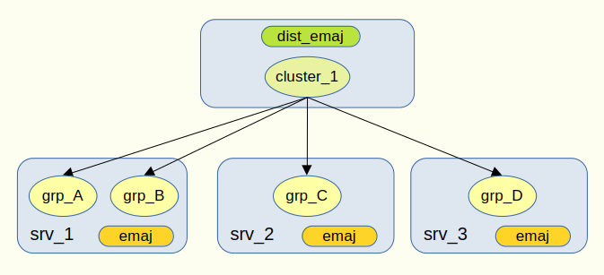
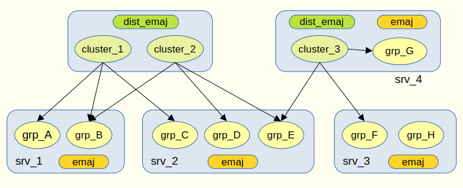

Architecture et principes de fonctionnement
===========================================

.. raw:: html

    

Architecture
------------

Les extensions emaj
^^^^^^^^^^^^^^^^^^^

Chaque *serveur E-Maj* a son extension *emaj*, sur lequel sont créés et configurés ses groupes de tables.

L'extension dist_emaj
^^^^^^^^^^^^^^^^^^^^^

Une extension **dist_emaj** doit être créée dans une base de donnée PostgreSQL quelconque sur le réseau. Cette base de données peut, elle-même, héberger une extension *emaj*.

L'extension *dist_emaj* contient quelques tables techniques et fonctions permettant son utilisation. 

Les fonctions permettent notamment de **configurer** les *clusters* (avec les groupes de tables qui y sont rattachés) et les *serveurs* (avec leur paramètres d'accès réseau).

----

Principes de fonctionnement
---------------------------

Cohérence globale
^^^^^^^^^^^^^^^^^

Pour assurer la consistance des opérations, notamment des *rollbacks distribués*, toutes les opérations sur les clusters sont réalisées dans des **transactions uniques et globales** validées par du **commit à 2 phases**.

La mise en oeuvre de transactions globales nécessite que les opérations concernées soient initiées en dehors de PostgreSQL. Pour ce faire, **deux clients** codés en Perl sont fournis :

- ``distEmaj.pl`` : 

   - **démarre** un *cluster*, c'est à dire démarre tous les groupes de tables qui y sont attachés,
   - **arrête** un *cluster*, c'est à dire arrête tous les groupes de tables qui y sont attachés,
   - **pose** une *marque distribuée* sur tous les groupes de tables attachés au *cluster*.
- ``distEmajRollback.pl`` : effectue un **rollback distribué** ciblant une *marque distribuée* pour un *cluster*.

Parallélisation
^^^^^^^^^^^^^^^

Les étapes les plus longues des opérations sont **exécutées en parallèle** sur tous les *serveurs* du *cluster*.

De plus, les principales étapes d'un **rollback** sur un *serveur* peuvent elles-mêmes être réparties sur **plusieurs sessions**. Le nombre de *sessions de rollback* à utiliser est un des paramètres de configuration d'un serveur.

Indépendance entre emaj et dist-emaj
^^^^^^^^^^^^^^^^^^^^^^^^^^^^^^^^^^^^

**Les extensions emaj n’ont pas connaissance des extensions dist_emaj** qui les référencent.

Ainsi, pour un *serveur* donné :

- le démarrage ou l'arrêt d'un *cluster* se traduit localement par le "simple" démarrage ou arrêt des groupes de tables hébergés par le *serveur*,
- la pose d'une *marque distribuée* se traduit localement par la pose d'une simple *marque* sur les groupes de tables,
- l'exécution d'un *rollback distribué* se déroule localement comme un rollback standard des groupes de tables.

**Un groupe de tables peut être référencé par plusieurs clusters** d’une ou plusieurs extensions *dist_emaj*.

----

Exemples de configuration
-------------------------

Configuration simple d'un cluster
^^^^^^^^^^^^^^^^^^^^^^^^^^^^^^^^^

   Figure 1 – Configuration d'un *cluster*.

Ici, 1 *cluster* comprend 4 groupes de tables qui sont répartis sur 3 *serveurs* différents, "grp_A" et "grp_B" se trouvant sur la même base de données.

Configuration complexe de plusieurs clusters
^^^^^^^^^^^^^^^^^^^^^^^^^^^^^^^^^^^^^^^^^^^^

   Figure 2 – Configuration complexe.

On trouve ici :

- 3 *clusters* répartis dans 2 extensions *dist_emaj*,
- les deux extensions *dist_emaj* et *emaj* cohabitent sur le *serveur* "srv_4",
- sur le serveur "srv_3", le groupe de tables "grp_H" n'est associé à aucun *cluster*.
